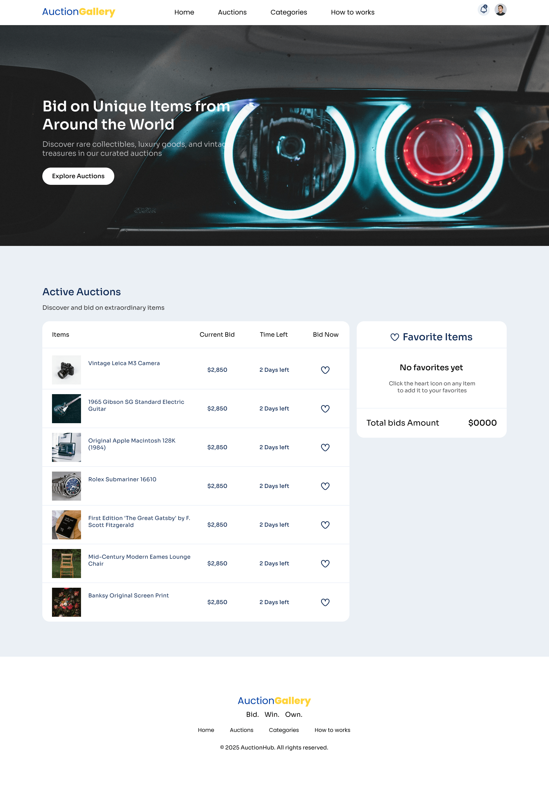

# 🖼️ AuctionGallery

Welcome to **AuctionGallery**, a modern React-based auction web application where users can explore and bid on unique items from around the world. The app allows users to favorite items, track total bids, and enjoy a clean, responsive UI.

## 🚀 Live Preview

🌐 **Live Link:** [Click here to view the site](https://auctiongallary4.netlify.app/)  
*(Replace this link with your deployed website URL)*

---

## 📸 Screenshots



---

## 🧩 Features

- 🔍 Browse active auctions
- ❤️ Favorite items with heart icons
- 📊 Track total bid amounts in real-time
- 🔔 Clean and responsive navbar with icons
- 🧭 Beautiful banner section
- 📁 Organized code with reusable components
- 🍞 Toast notifications for actions

---

## 🛠️ Tech Stack

- **React 19**
- **Tailwind CSS**
- **React Icons**
- **React Toastify**
- **Vite**

---


---

## 🧪 Installation & Setup

```bash
# Clone the repo
git clone https://github.com/Ahammad204/auction-gallery

# Navigate to project folder
cd auction-gallery

# Install dependencies
npm install

# Start development server
npm run dev
```

---

## 🔔 Dependencies

```json
"react": "^19.0.0",
"react-dom": "^19.0.0",
"react-icons": "^5.5.0",
"react-toastify": "^11.0.5"
```

## 📦 DevDependencies

```json
"tailwindcss": "^4.1.3",
"vite": "^6.2.0",
"daisyui": "^5.0.17",
"eslint": "^9.21.0",
"@vitejs/plugin-react": "^4.3.4"
```

---

## 👨‍💻 Author

- Developed by [Kazi Ahammad Ullah](https://github.com/Ahammad204) 💻

---

## 📜 License

This project is licensed under the MIT License.

---

## 🙌 Support

If you like this project, give it a ⭐️  
Have any suggestions or issues? Feel free to open an issue or PR.

```

---

